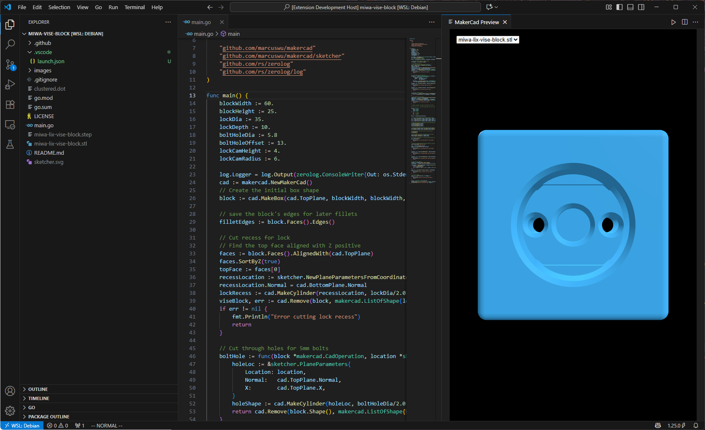
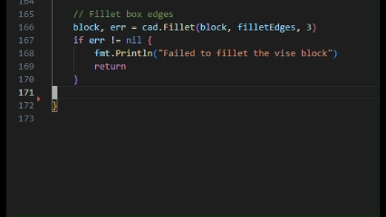

# makercad-vscode README

A VSCode extension for [MakerCAD](https://github.com/marcuswu/makercad).

## Features

Preview window will provide an up to date view of .stl files generated by the project.

Some snippets are also available:

## Requirements

Must have [MakerCAD](https://github.com/marcuswu/makercad) installed.

## Extension Settings

This extension contributes the following settings:

* `makercadExtension.modelViewDist`: Set the default model view distance

## Release Notes

### 1.0.0

Initial release of MakerCAD extension
